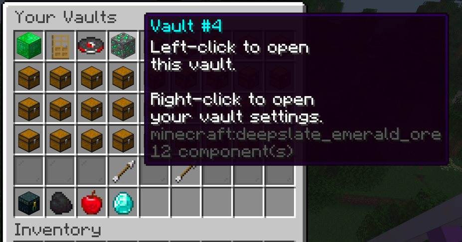
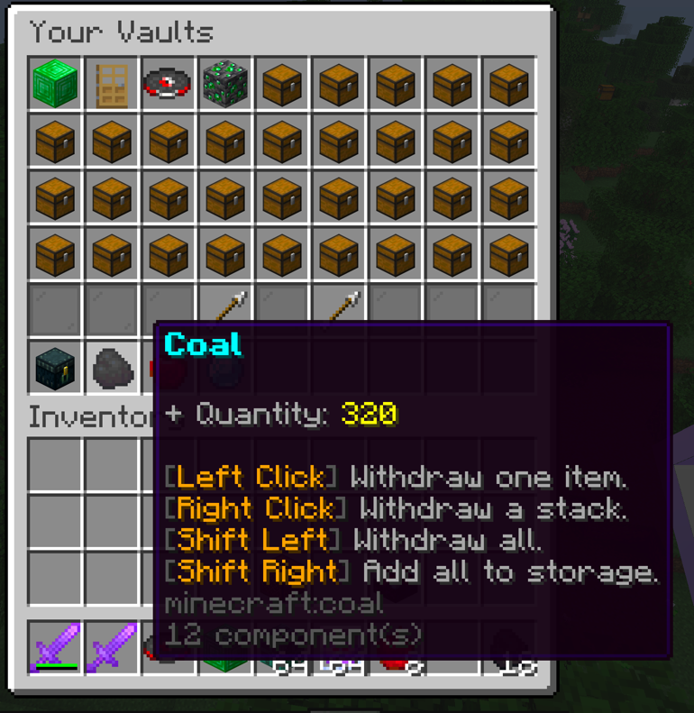
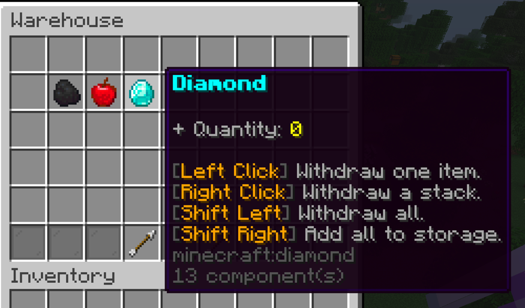
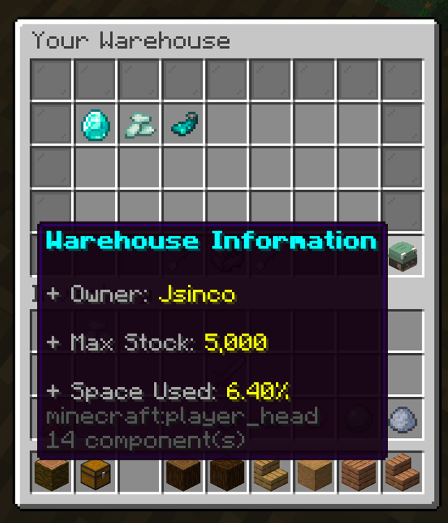
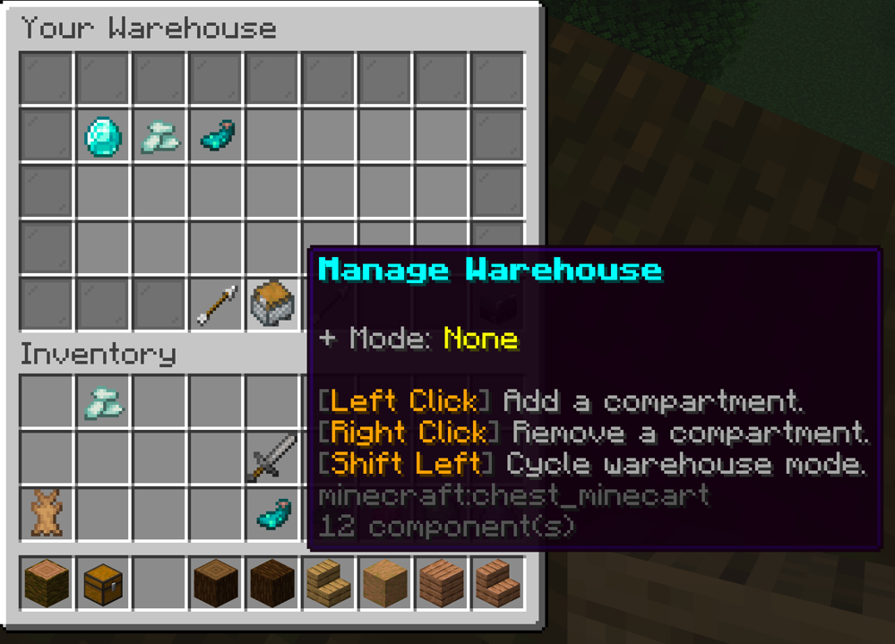

# Gringotts

An expansive 'playervaults' style plugin that incorporates a warehouse for mass item storage.

> [!IMPORTANT]
> This project is currently in beta!
> Support is only guaranteed for the latest versions on PaperMC-based servers.

Beta builds can be found on Modrinth and Hangar:

- https://modrinth.com/mod/gringotts
- https://hangar.papermc.io/BreweryTeam/Gringotts

## Quick overview of features if you're familiar with Vault plugins:

- A vault system similar to "PlayerVaults" vaults plugin.
- The ability for players to change the name, icon, and add "trusted" players to their vaults.
- The ability for players to share their vaults with other players of their choosing.
- A warehouse system for mass item storage.
- Guis for managing vaults and warehouse.
- The ability for admins to manage all vaults and warehouses.
- SQLite & MySQL support.
- A converter to migrate from "PlayerVaults/PlayerVaultsX".

## Some more info on Gringotts (for those who aren't familiar):

- Gringotts is an open-source plugin that allows players to use vaults and a warehouse to store items.

### Vaults
Vaults are virtual chests that players may use to store items of their choosing. They work very similarly to vaults
from the "PlayerVaults" plugin. Gringotts includes a GUI to show players their vaults in a nice and orderly fashion.
Player can customize, change the name, and even trust other players to their vaults to share them! The amount of
vaults a player can access is configurable and dynamically modifiable through commands!

### Warehouse
Every player get their own warehouse. Players can store materials in large quantities in their warehouse. The amount
of material they can store is based on their maximum stock which is configurable through commands and/or permissions.
The warehouse also has additional features such as "auto storing", "click to deposit", and "auto replenish".

### Importing
Gringotts supports importing vaults from "PlayerVaults" currently. More importers will be added closer to Gringotts' first
non-beta release.

### Quickbar
In the vaults gui,
a quickbar showing the most recently accessed warehouse compartments is available for player convenience.
This can be configured.

### QuickReturn
Players can right-click outside any Gringotts gui to return to "Your Vaults" gui. This can be configured.

Gringotts has other nuanced features too.
As stated before, this project is in **beta** and should not be used on production servers at the moment.
Gringotts only supports PaperMC-based servers.

Attached below are a showcase of some of the guis in Gringotts:

