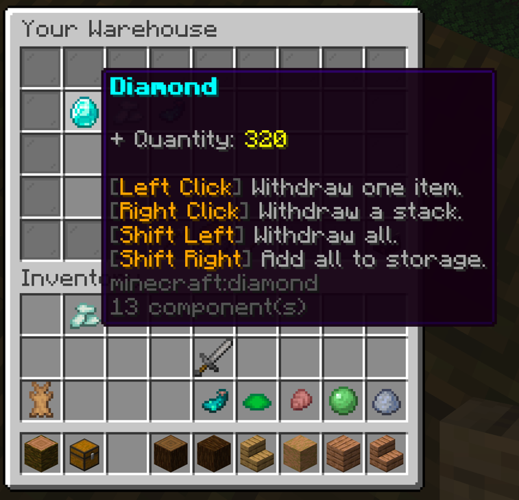

An expansive "playervaults" style plugin that incorporates a warehouse for mass item storage.

This project is currently in early development.

In case you're checking this out, here's
what I have planned for this project:

- A vault system similar to "PlayerVaults" vaults plugin.
- The ability for players to change the name, icon, and add "trusted" players to their vaults.
- The ability for players to share their vaults with other players of their choosing.
- A warehouse system for mass item storage.
- Guis for managing vaults and warehouse.
- The ability for admins to manage all vaults and warehouses.
- SQLite & MySQL support.
- A converter to migrate from "PlayerVaults/PlayerVaultsX".

As stated before, this project is in a very *slow* and
*early* development stage. Below are some images of a
few of the guis that have been implemented for this plugin.

